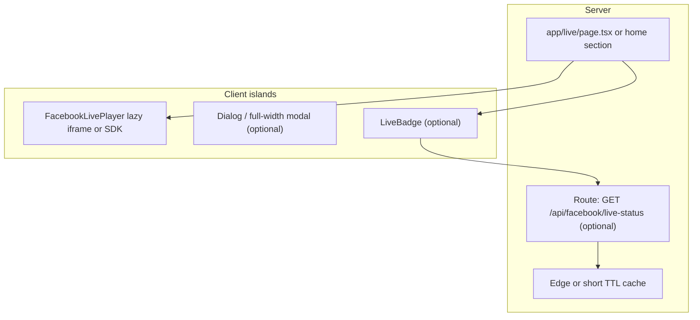

# Facebook Live integration — scope document

**Project:** NWI Fun Ball (Next.js 15, React 19)  
**Purpose:** Technical scope for adding Facebook Live viewing, optional live status, and client-facing effort/pricing guidance.

---

## 1. Current site architecture (as of this branch)

### 1.1 Stack and layout

| Area | Implementation |
|------|----------------|
| Framework | Next.js **15** (App Router), React **19** |
| Styling | Tailwind CSS 3.4, custom tokens (`nwi-*`), `app/globals.css` |
| Root shell | `app/layout.tsx` — sets `metadata` (OG/Twitter), optional `facebook.appId` from `NEXT_PUBLIC_FACEBOOK_APP_ID`, `Inter` font, minimal body wrapper |
| Global container | Home uses `main.panel-shell` with max width ~1120px |

### 1.2 Pages (App Router)

| Route | Role |
|-------|------|
| `app/page.tsx` | Marketing home: Header, Hero, ticker, Intro, tickets, schedule, gallery/contact placeholders, Footer |
| `app/checkout/page.tsx` | Client checkout form → `POST /api/checkout` |
| `app/confirmation/page.tsx` | Post-purchase confirmation |
| `app/verify/[ticketId]/page.tsx` | Ticket verification |
| `app/api/checkout/route.ts` | Stripe Checkout session creation |
| `app/api/webhooks/stripe/route.ts` | Stripe webhooks |

### 1.3 Components (high level)

- **Layout / chrome:** `Header.tsx` (client, sticky nav, hash links including `#video`), `Footer.tsx` (server)
- **Marketing:** `Hero.tsx`, `ScrollingTicker.tsx`, `IntroSection.tsx`, `TicketGrid.tsx`, `ScheduleCalendar.tsx`
- **Video:** `VideoPlaceholder.tsx` exists but is **not** mounted on the home page; `#video` is in nav with no matching section on `page.tsx`
- **UI primitives:** `components/ui/button.tsx`, `card.tsx`

### 1.4 Data and integrations (not Supabase)

**There is no Supabase in this repository.** Persistence and third-party services observed:

- **Neon (PostgreSQL):** `@neondatabase/serverless` in `lib/db.ts` — `orders` table, used with Stripe flow
- **Stripe:** checkout + webhooks
- **Resend:** `lib/email.ts` (if wired from webhooks)
- **Facebook (present):** `IntroSection.tsx` embeds a Facebook Reel via `https://www.facebook.com/plugins/video.php?href=...` in an `<iframe>` with `allow` including autoplay-related permissions

### 1.5 SEO and accessibility baseline

- Semantic landmarks (`main`, `header`/`banner`, `footer`/`contentinfo`), section headings with `aria-labelledby`
- `metadata` and OG images configured in `layout.tsx`
- Sticky header and in-page hash navigation; smooth scroll in CSS

---

## 2. Research summary — Facebook Live embedding and Next.js 15+

Sources: [Meta Embedded Video Player](https://developers.facebook.com/docs/plugins/embedded-video-player/), [Embedded Video Player API](https://developers.facebook.com/docs/plugins/embedded-video-player/api/), [Graph API — Live Videos](https://developers.facebook.com/docs/graph-api/reference/user/live_videos/), Next.js [Videos guide](https://nextjs.org/docs/app/building-your-application/optimizing/videos).

### 2.1 iframe vs SDK (`fb-video` / XFBML)

- **iframe (`plugins/video.php`):** Simplest path; works for **both VOD and Live** when you have a stable public video URL. Minimal JS; good for RSC-heavy pages if the embed is static or wrapped in a small client island.
- **Facebook SDK + `fb-video` div:** Enables **Embedded Video Player API** (`play`, `seek`, `isMuted`, event subscriptions after `xfbml.parse`). Requires client-side script load and parsing — naturally a **Client Component** or dynamically imported client module.

### 2.2 React Server Components (RSC) fit

- **Default:** Keep the **page as a Server Component**; isolate Facebook script/DOM work in `"use client"` components or `next/dynamic` with `ssr: false` for SDK-based embeds.
- **Why:** Third-party widgets need `window`, script injection, and hydration boundaries; pushing that to a leaf keeps the rest of the tree server-rendered for performance and SEO.

### 2.3 Live status (dynamic)

- **Embed URL alone** does not give you a reliable “LIVE” badge; the iframe shows whatever Meta serves for that `href`.
- **Graph API:** Page (or app with correct permissions) can query **`/{page-id}/live_videos`** or related video objects and inspect **`status`** (e.g. distinguish **`LIVE`** vs **`SCHEDULED_LIVE`** — scheduled is not the same as broadcasting). This requires a **server-side token** (never expose Page tokens to the browser), caching, and error handling for rate limits and policy changes.
- **Pragmatic alternative:** Manual or CMS-driven flag during events (no Graph dependency), or a **lightweight polling route** that returns cached JSON.

### 2.4 Autoplay

- Meta’s plugin supports autoplay-related options in the **SDK path** (e.g. `data-autoplay` — typically **muted** behavior is platform-dependent).
- **Best practice:** Do not rely on autoplay with sound; expect **mobile browsers** to block or limit autoplay. Prefer **user gesture** (“Watch live”) to start playback inside a modal or dedicated page.
- **Accessibility:** Autoplay can disrupt screen reader users; provide **clear controls** and respect `prefers-reduced-motion` for ancillary animations (badge pulse), not for stripping the embed unless product requires it.

### 2.5 Mobile / responsive

- Use a **responsive wrapper** (aspect-ratio box + `absolute` iframe filling 100%) — the project already uses this pattern in `IntroSection.tsx` (`pt-[177.78%]` for vertical reel-style video).
- **Live** often works better in **16:9**; adjust aspect ratio and `plugins/video.php` `width`/`height` or container-driven sizing per design.
- Test **iOS Safari** (iframe + third-party cookies / login state can affect behavior).

### 2.6 Performance

- **Lazy load** the embed: default to poster + “Watch live” / placeholder; load iframe or SDK only when in viewport (`IntersectionObserver`) or on click (best for LCP and main-thread).
- **Privacy / weight:** SDK is heavier than iframe-only; use SDK only if you need programmatic control.

### 2.7 SEO

- Add a **dedicated route** (e.g. `/live`) with `metadata` title/description and canonical URL for shareability.
- Structured data (`BroadcastEvent` / `Event`) is optional and only honest if times and URLs are accurate.

---

## 3. Implementation options (2–3) — RSC-first, performance, a11y, SEO

### Option A — **iframe-only, lazy-loaded client island** (recommended baseline)

- **Architecture:** Server page composes a small `FacebookVideoEmbed` client component that lazy-loads iframe on click or when visible.
- **Pros:** Least JS, aligns with existing `IntroSection` pattern, easy to reason about, good Core Web Vitals if gated.
- **Cons:** No programmatic play API; “live” state not automatic without separate API/manual flag.

### Option B — **SDK embed + optional Embedded Video Player API**

- **Architecture:** Client-only island loads `connect.facebook.net/...sdk.js`, renders `fb-video`, subscribes to `xfbml.ready` for controls if needed.
- **Pros:** Official control surface; can align with `NEXT_PUBLIC_FACEBOOK_APP_ID` already in metadata.
- **Cons:** More script weight and failure modes; stricter CSP and ad-block considerations.

### Option C — **Dedicated `/live` + Graph-backed “LIVE” badge** (highest fidelity)

- **Architecture:** Route-level SEO; server route handler fetches cached live status from Graph; client island for actual player (A or B).
- **Pros:** Accurate badge when API access is available; shareable live URL.
- **Cons:** Meta app review, tokens, caching, and operational monitoring; more security review surface.

**Suggested product default:** **Option A** for ship speed and stability; add **Option C** status endpoint only if the client needs an automated LIVE indicator.

---

## 4. Detailed delivery scope

### 4.1 Technical architecture (target)

- **RSC boundary:** Pages/sections remain server components; embed and interactive UI are client leaves.
- **Secrets:** Any Page access token for Graph lives in **server-only** env vars (`FACEBOOK_PAGE_ACCESS_TOKEN` or similar), never `NEXT_PUBLIC_*`.

### 4.2 New / changed files (indicative)

| File / area | Responsibility |
|-------------|------------------|
| `components/FacebookLiveEmbed.tsx` (client) | Responsive iframe or SDK wrapper; lazy load; title prop for a11y |
| `components/LiveStatusBadge.tsx` (client, optional) | Polls or reads initial server prop for “LIVE” |
| `app/api/facebook/live-status/route.ts` (optional) | Server: Graph fetch + cache + error shape |
| `lib/facebook.ts` (optional) | Graph client helpers, typed responses |
| `app/live/page.tsx` (optional) | Dedicated SEO page, metadata export |
| `app/page.tsx` / `IntroSection.tsx` | Wire live block OR replace reel placeholder with configurable URL via env |
| `components/Header.tsx` | Optional nav link to `/live` or `#live` |
| `.env.example` | Document `NEXT_PUBLIC_FACEBOOK_APP_ID`, video URL, optional tokens |

### 4.3 UI/UX flow

1. **Default (not live):** Show branded placeholder, next game CTA, link to Facebook Page.
2. **Live (manual flag or API):** Show **LIVE** badge (high contrast, not color-only); primary CTA **Watch live** opens:
   - **Inline:** expand section to full-width player (simpler), or  
   - **Modal:** `dialog` with focus trap, ESC close, `aria-modal`, labelled close button (better for keyboard/sr users on small screens).
3. **Post-live:** Same embed shows VOD if Meta exposes it for the same URL, or fallback message.

### 4.4 Facebook App / Graph API setup steps (for Option C or future-proofing)

1. Create/select a **Meta app** in [developers.facebook.com](https://developers.facebook.com/).
2. Add **Facebook Login** or relevant use case; configure **OAuth redirect URIs** if needed for admin tools only (public site does not need user login for embed).
3. Associate the app with the **Facebook Page** that will go live.
4. Generate a **Page access token** with permissions to read **`live_videos`** (exact permission names depend on current Meta dashboard — verify in **Graph API Explorer**).
5. For production, complete any **app review** steps Meta requires for the permissions used.
6. Store token server-side; implement **short TTL cache** (e.g. 30–120s) on status endpoint to limit Graph calls.
7. **Domain / embed:** Ensure the site domain is consistent with Meta app settings where required for plugins/SDK.

*Note: Meta policies and permission names change; validate against current documentation before quoting compliance work.*

### 4.5 Effort estimate (senior engineer)

| Tier | Scope | Hours (indicative) |
|------|--------|---------------------|
| **Low** | Option A: env-driven video URL, responsive lazy iframe, wire `#video` or new `/live` with metadata, basic a11y (title, focus for modal if included) | **8–14** |
| **Medium** | Low + modal dialog UX, header nav, branded offline states, analytics hooks (optional), staging verification on iOS/Android | **14–22** |
| **High** | Medium + Option C Graph status, caching, monitoring, error fallbacks, optional structured data, runbook for token rotation | **22–36** |

Ranges include implementation, code review fixes, and QA; they **exclude** lengthy Meta app review back-and-forth (track as risk).

---

## 5. Client add-on pricing (USD)

Assume **$120–180/hr** senior rate.

| Complexity | Hours (from §4.5) | Low rate (120) | High rate (180) |
|------------|-------------------|----------------|-----------------|
| **Low** | 8–14 | **$960 – $1,680** | **$1,440 – $2,520** |
| **Medium** | 14–22 | **$1,680 – $2,640** | **$2,520 – $3,960** |
| **High** | 22–36 | **$2,640 – $4,320** | **$3,960 – $6,480** |

**Fair add-on range to quote a client (rounded):**

- **Low:** **~$1.0k – $2.5k**
- **Medium:** **~$1.7k – $4.0k**
- **High:** **~$2.6k – $6.5k**

**Breakdown guidance for proposals:**

- **Implementation & integration** — 60–70%  
- **QA (desktop + mobile Safari/Chrome)** — 15–20%  
- **Meta configuration / documentation handoff** — 10–20% (higher for High tier)  
- **Contingency** for review delays or API permission friction — 10–15% of subtotal (optional line item)

---

## 6. Risks and assumptions

- Live embed availability depends on **Page/video privacy** and Meta’s embed rules.
- **Graph API** access may require app review; tokens must be rotated securely.
- **Nav vs content:** `#video` is currently in the header but the home page does not render `VideoPlaceholder`; any live feature should **reconcile** hash targets to avoid dead links.

---

*Document generated for planning; implementation should follow Meta’s current docs and the client’s legal/compliance requirements.*
